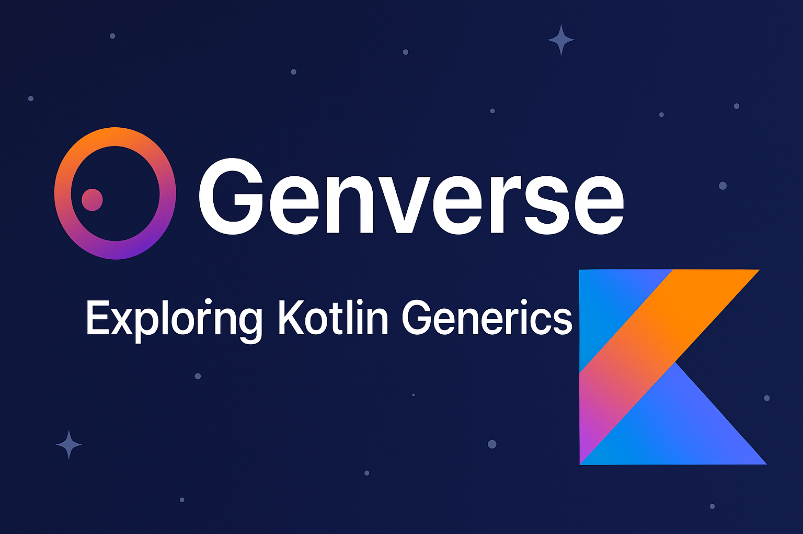

# Genverse

A Kotlin project exploring all generic programming concepts.

---

# 🌌 Genverse — A Journey Through Kotlin Generics

> **"Write once, reuse everywhere — with the power of Generics."**

Genverse is a **comprehensive Kotlin project** demonstrating the full range of **Generic programming concepts**, from type parameters to variance and reified types.
It’s designed for developers and students who want to **master generics** in real-world applications — not just theory.

---

## 🚀 Features

✅ Covers **all major generic concepts** in Kotlin:

* **Generic Functions** — Reusable, type-safe utility functions.
* **Generic Classes** — Building flexible data containers.
* **Generic Interfaces** — Designing contracts that work for any data type.
* **Bounded Type Parameters** — Restricting generics with `: Number`, `: Comparable`, etc.
* **Variance (`in` / `out`)** — Understanding Kotlin’s type projection and PECS rule.
* **Reified Type Parameters** — Preserving type info at runtime with `inline` functions.
* **Generic Constraints & Multiple Bounds** — Crafting robust APIs.
* **Practical Use-Cases in App Development** — Networking, data caching, and adapters.

---

## 🧩 Project Structure

```
Genverse/
│
├── src/
│   ├── main/kotlin/
│   │   ├── generics/
│   │   │   ├── GenericFunctions.kt
│   │   │   ├── GenericClasses.kt
│   │   │   ├── GenericInterfaces.kt
│   │   │   ├── BoundedTypes.kt
│   │   │   ├── VarianceExample.kt
│   │   │   ├── ReifiedExample.kt
│   │   │   ├── MultiBoundConstraints.kt
│   │   │   └── AppUseCases.kt
│   │   └── Main.kt
│   │
│   └── resources/
│
├── build.gradle.kts
└── README.md
```

---

## 💡 Concepts Illustrated

| Concept               | File                       | Description                                                                     |
| --------------------- | -------------------------- | ------------------------------------------------------------------------------- |
| **Generic Function**  | `GenericFunctions.kt`      | Demonstrates generic utility functions like `swap`, `printList`, and `compare`. |
| **Generic Class**     | `GenericClasses.kt`        | Shows flexible containers like `Box<T>` and `Response<T>`.                      |
| **Generic Interface** | `GenericInterfaces.kt`     | Defines type-safe contracts such as `Repository<T>`.                            |
| **Bounded Types**     | `BoundedTypes.kt`          | Restricts type parameters using upper bounds like `T : Number`.                 |
| **Variance**          | `VarianceExample.kt`       | Explains `in` and `out` with producer-consumer examples.                        |
| **Reified Types**     | `ReifiedExample.kt`        | Demonstrates runtime type checks with `inline fun <reified T>`.                 |
| **Multiple Bounds**   | `MultiBoundConstraints.kt` | Combines constraints like `T : Number, T : Comparable<T>`.                      |
| **App Use Cases**     | `AppUseCases.kt`           | Applies generics to networking, caching, and adapters.                          |

---

## 🧠 Learning Outcomes

By exploring **Genverse**, you’ll learn to:

* Write **cleaner**, **type-safe**, and **reusable** Kotlin code.
* Understand **variance modifiers** deeply (`in`, `out`).
* Apply generics effectively in **real-world Android and Kotlin applications**.
* Use **reified generics** for runtime-safe operations.

---

## 🧪 Run the Project

### Prerequisites

* Kotlin 1.9+
* JDK 17+
* IntelliJ IDEA or VS Code with Kotlin plugin

### Steps

```bash
git clone https://github.com/cosmichackerx/Genverse.git
cd Genverse
./gradlew run
```

---

## 📸 Example Output

```
🌀 Welcome to Genverse — Exploring Kotlin Generics!

[1] Generic Function: swap() → before: (A,B), after: (B,A)
[2] Generic Class: Box<String>("Galaxy") → value = Galaxy
[3] Bounded Type: Max value between 5 and 10 is 10
[4] Reified Example: Checking type of List<Int> at runtime → true
[5] Variance Example: CovariantProducer<String> → produced: Kotlin
...
```

---

## 🌠 Author

👤 **Muhammad Arslan**
🎓 *Bachelor's in Computer Science (BSCS)*
💻 Passionate about **Kotlin, AI, and Clean Code**

📫 **Connect:** [LinkedIn](https://linkedin.com/in/cosmichackerx) | [GitHub](https://github.com/cosmichackerx)

---

## 🛡️ License

This project is licensed under the **MIT License** — free to use and modify.

---

## 🌌 Final Words

> *"Generics are not just about types — they’re about trust.
> Trust that your code will adapt, evolve, and never break the future."* 💫

---
